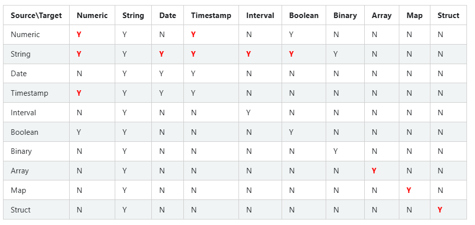
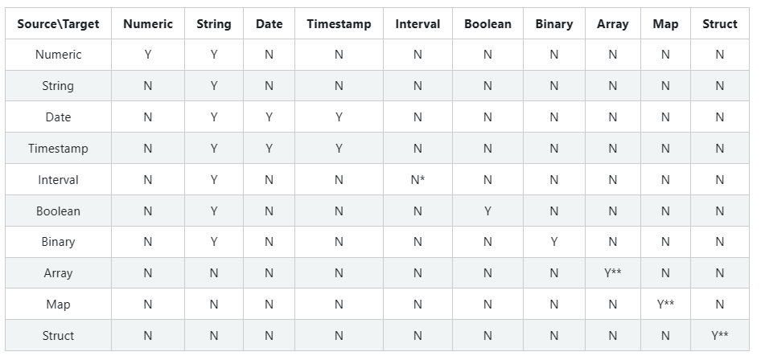
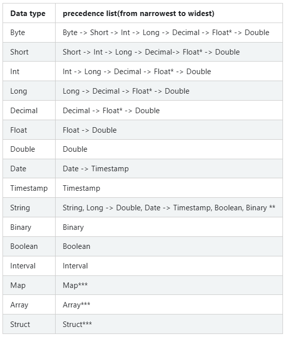
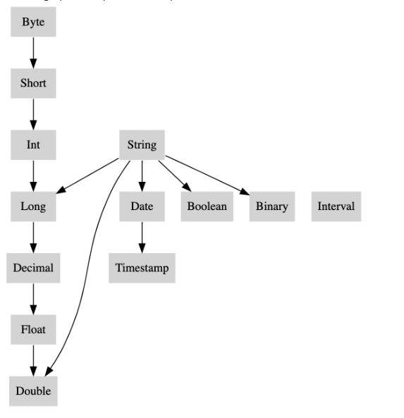

# ANSI Compliance

[TOC]

> In Spark SQL, there are two options to comply with the SQL standard: `spark.sql.ansi.enabled` and `spark.sql.storeAssignmentPolicy` (See a table below for details).

在 Spark SQL 中，存在两个遵守 SQL 标准的选项: `spark.sql.ansi.enabled` 和 `spark.sql.storeAssignmentPolicy`

> When `spark.sql.ansi.enabled` is set to `true`, Spark SQL uses an ANSI compliant dialect instead of being Hive compliant. For example, Spark will throw an exception at runtime instead of returning null results if the inputs to a SQL operator/function are invalid. Some ANSI dialect features may be not from the ANSI SQL standard directly, but their behaviors align with ANSI SQL’s style.

当 `spark.sql.ansi.enabled` 设为 `true` 时, Spark SQL 使用 ANSI 兼容语义，而不是 hive 兼容。

例如，如果 SQL 操作符/函数的输入无效，那么 spark 在运行时会抛出异常，而不是返回 null.

一些 ANSI 语义特点可能并不是直接来自 ANSI SQL 标准，而是行为和 ANSI SQL 风格一致。

> Moreover, Spark SQL has an independent option to control implicit casting behaviours when inserting rows in a table. The casting behaviours are defined as store assignment rules in the standard.

当在表里插入行时，Spark SQL 具有控制隐式转换行为的独立选项。在标准中，转换行为被定义为存储分配规则。

> When `spark.sql.storeAssignmentPolicy` is set to `ANSI`, Spark SQL complies with the ANSI store assignment rules. This is a separate configuration because its default value is `ANSI`, while the configuration `spark.sql.ansi.enabled` is disabled by default.

当 `spark.sql.storeAssignmentPolicy` 设为 `ANSI` 时, Spark SQL 遵守 ANSI 存储分配规则。

这是一个单独的配置，因为 `spark.sql.ansi.enabled` 配置默认是被禁用，此时它的默认值是 `ANSI`.

Property Name | Default | Meaning | Since Version
---|:---|:---|:---
`spark.sql.ansi.enabled` | `false` | When true, Spark tries to conform to the ANSI SQL specification: <br/>1. Spark SQL will throw runtime exceptions on invalid operations, including integer overflow errors, string parsing errors, etc. <br/>2. Spark will use different type coercion rules for resolving conflicts among data types. The rules are consistently based on data type precedence.<br/>【当为true时，spark尝试遵循ANSI SQL规范。1.sparksql遇到无效操作（包括整型溢出错误、字符串解析错误）时，将抛出运行时异常。2.为解决数据类型间的冲突,spark将使用不同的类型强制转换规则。这些规则始终基于数据类型优先级。】	| 3.0.0
`spark.sql.storeAssignmentPolicy` | `ANSI` | When inserting a value into a column with different data type, Spark will perform type conversion. Currently, we support 3 policies for the type coercion rules: ANSI, legacy and strict.【当往列中插入一个不同类型的值时，spark将执行类型转换。当前支持3种策略：ANSI、legacy、strict】<br/> 1. With ANSI policy, Spark performs the type coercion as per ANSI SQL. In practice, the behavior is mostly the same as PostgreSQL. It disallows certain unreasonable type conversions such as converting string to int or double to boolean. On inserting a numeric type column, an overflow error will be thrown if the value is out of the target data type’s range.<br/>【1.ANSI: Spark根据ANSI SQL执行类型强制转换。它不允许特定的不合理的类型转换，例如将字符串转为整型、将double转为布尔类型。当插入一个数值类型的列时，如果值超过了目标数据类型的范围，就会抛出溢出错误。】<br/> 2. With legacy policy, Spark allows the type coercion as long as it is a valid Cast, which is very loose. e.g. converting string to int or double to boolean is allowed. It is also the only behavior in Spark 2.x and it is compatible with Hive.<br/>【2.legacy: 只要是有效的转换，spark就允许类型转换，例如将字符串转为整型、将double转为布尔类型，都是允许的。这是仅在Spark 2.x中存在的行为，且和hive兼容。】<br/> 3. With strict policy, Spark doesn’t allow any possible precision loss or data truncation in type coercion, e.g. converting double to int or decimal to double is not allowed.<br/>【3.strict: 在类型转换中，spark不允许任意可能的精度丢失或数据截断。例如将double转为整型、或decimal转为double是不允许的】| 3.0.0

> The following subsections present behaviour changes in arithmetic operations, type conversions, and SQL parsing when the ANSI mode enabled. For type conversions in Spark SQL, there are three kinds of them and this article will introduce them one by one: cast, store assignment and type coercion.

下面的内容描述了，当启用了 ANSI 模式时，在算术运算、类型转换和 SQL 解析中行为的变化。

存在三种类型: cast\ store assignment\ type coercion

## Arithmetic Operations

> In Spark SQL, arithmetic operations performed on numeric types (with the exception of decimal) are not checked for overflows by default. This means that in case an operation causes overflows, the result is the same with the corresponding operation in a Java/Scala program (e.g., if the sum of 2 integers is higher than the maximum value representable, the result is a negative number). On the other hand, Spark SQL returns null for decimal overflows. When `spark.sql.ansi.enabled` is set to `true` and an overflow occurs in numeric and interval arithmetic operations, it throws an arithmetic exception at runtime.

在 Spark SQL 中，默认情况下，在数值类型（decimal除外）上执行的算术运算不会被检查是否溢出。

这就意味着，对于操作造成溢出的情况，其结果和对应的 Java/Scala 程序的结果相同（例如，如果两个整型的和大于可呈现的最大值，那么结果就是一个负数）。

另一方面，Spark SQL 会为 decimal 的溢出返回 null.

当 `spark.sql.ansi.enabled` 设为 true 时，数值和间隔算术运算中出现溢出，就会抛出运行时算术异常。

```sql
-- `spark.sql.ansi.enabled=true`
SELECT 2147483647 + 1;
java.lang.ArithmeticException: integer overflow

SELECT abs(-2147483648);
java.lang.ArithmeticException: integer overflow

-- `spark.sql.ansi.enabled=false`
SELECT 2147483647 + 1;
+----------------+
|(2147483647 + 1)|
+----------------+
|     -2147483648|
+----------------+

SELECT abs(-2147483648);
+----------------+
|abs(-2147483648)|
+----------------+
|     -2147483648|
+----------------+
```

## Cast

> When `spark.sql.ansi.enabled` is set to `true`, explicit casting by `CAST` syntax throws a runtime exception for illegal cast patterns defined in the standard, e.g. casts from a string to an integer.

当 `spark.sql.ansi.enabled` 设为 `true`，使用 `CAST` 语法执行显示转换会抛出一个运行时异常，因为定义在标准中的非法的转换模式，例如，从一个字符串转为一个整型。

> Besides, the ANSI SQL mode disallows the following type conversions which are allowed when ANSI mode is off:

ANSI SQL 模式不允许下面的类型转换，而在 ANSI 模式关闭的时候才被允许：

- Numeric <=> Binary
- Date <=> Boolean
- Timestamp <=> Boolean
- Date => Numeric

> The valid combinations of source and target data type in a `CAST` expression are given by the following table. “Y” indicates that the combination is syntactically valid without restriction and “N” indicates that the combination is not valid.

`CAST` 表达式中的源数据类型和目标数据类型的有效结合由下面的表给出。

Y 表示语法上结合是有效的，没有限制

N 表示结合是无效的



> In the table above, all the CASTs that can cause runtime exceptions are marked as red Y:

上表中，所有会造成运行时异常的转换都被标记为红色的Y

- CAST(Numeric AS Numeric): raise an overflow exception if the value is out of the target data type’s range.
- CAST(String AS (Numeric/Date/Timestamp/Interval/Boolean)): raise a runtime exception if the value can’t be parsed as the target data type.
- CAST(Timestamp AS Numeric): raise an overflow exception if the number of seconds since epoch is out of the target data type’s range.
- CAST(Numeric AS Timestamp): raise an overflow exception if numeric value times 1000000(microseconds per second) is out of the range of Long type.
- CAST(Array AS Array): raise an exception if there is any on the conversion of the elements.
- CAST(Map AS Map): raise an exception if there is any on the conversion of the keys and the values.
- CAST(Struct AS Struct): raise an exception if there is any on the conversion of the struct fields.

```sql
-- Examples of explicit casting

-- `spark.sql.ansi.enabled=true`
SELECT CAST('a' AS INT);
java.lang.NumberFormatException: invalid input syntax for type numeric: a

SELECT CAST(2147483648L AS INT);
java.lang.ArithmeticException: Casting 2147483648 to int causes overflow

SELECT CAST(DATE'2020-01-01' AS INT)
org.apache.spark.sql.AnalysisException: cannot resolve 'CAST(DATE '2020-01-01' AS INT)' due to data type mismatch: cannot cast date to int.
To convert values from date to int, you can use function UNIX_DATE instead.

-- `spark.sql.ansi.enabled=false` (This is a default behaviour)
SELECT CAST('a' AS INT);
+--------------+
|CAST(a AS INT)|
+--------------+
|          null|
+--------------+

SELECT CAST(2147483648L AS INT);
+-----------------------+
|CAST(2147483648 AS INT)|
+-----------------------+
|            -2147483648|
+-----------------------+

SELECT CAST(DATE'2020-01-01' AS INT)
+------------------------------+
|CAST(DATE '2020-01-01' AS INT)|
+------------------------------+
|                          null|
+------------------------------+

-- Examples of store assignment rules
CREATE TABLE t (v INT);

-- `spark.sql.storeAssignmentPolicy=ANSI`
INSERT INTO t VALUES ('1');
org.apache.spark.sql.AnalysisException: Cannot write incompatible data to table '`default`.`t`':
- Cannot safely cast 'v': string to int;

-- `spark.sql.storeAssignmentPolicy=LEGACY` (This is a legacy behaviour until Spark 2.x)
INSERT INTO t VALUES ('1');
SELECT * FROM t;
+---+
|  v|
+---+
|  1|
+---+
```

## Store assignment

> As mentioned at the beginning, when `spark.sql.storeAssignmentPolicy` is set to `ANSI`(which is the default value), Spark SQL complies with the ANSI store assignment rules on table insertions. The valid combinations of source and target data type in table insertions are given by the following table.

正如开始提及的，当 `spark.sql.storeAssignmentPolicy` 设为 `ANSI`(默认值)时，Spark SQL 遵循表插入时的 ANSI 存储分配规则。

表插入时，源数据类型和目标数据类型的有效结合由下表给出。 



> `*` Spark doesn’t support interval type table column.

spark 不支持间隔类型表列。

> `**` For Array/Map/Struct types, the data type check rule applies recursively to its component elements.

对于 Array/Map/Struct 类型，数据类型检查规则递归地应用到它的组件元素。

> During table insertion, Spark will throw exception on numeric value overflow.

在表插入期间，spark 将在数值溢出时抛出异常。

```sql
CREATE TABLE test(i INT);

INSERT INTO test VALUES (2147483648L);
java.lang.ArithmeticException: Casting 2147483648 to int causes overflow
```

## Type coercion
### Type Promotion and Precedence

> When `spark.sql.ansi.enabled` is set to true, Spark SQL uses several rules that govern how conflicts between data types are resolved. At the heart of this conflict resolution is the Type Precedence List which defines whether values of a given data type can be promoted to another data type implicitly.

当 `spark.sql.ansi.enabled` 设为 true 时，Spark SQL 使用多种规则，管理着数据类型解析时的冲突。

这种冲突解决的核心是类型优先级列表，它定义了给定的数据类型是否能被隐式地提升到其他数据类型。



> `*` For least common type resolution float is skipped to avoid loss of precision.

对于最不常见的类型冲突解决，float 被跳过以避免精度损失。

> `**` String can be promoted to multiple kinds of data types. Note that Byte/Short/Int/Decimal/Float is not on this precedent list. The least common type between Byte/Short/Int and String is Long, while the least common type between Decimal/Float is Double.

String 可被提升到多种数据类型。注意 Byte/Short/Int/Decimal/Float 不在这个优先级列表上。

> `***` For a complex type, the precedence rule applies recursively to its component elements.

对于复杂类型，优先级规则递归地应用到它的组件元素。

> Special rules apply for untyped NULL. A NULL can be promoted to any other type.

特殊的规则应用于没有类型的 NULL 上。一个 NULL 可用被提升到任意其他类型。

> This is a graphical depiction of the precedence list as a directed tree:

这是优先级列表作为有向树的图形描述:



### Least Common Type Resolution

The least common type from a set of types is the narrowest type reachable from the precedence list by all elements of the set of types.

The least common type resolution is used to:

- Derive the argument type for functions which expect a shared argument type for multiple parameters, such as coalesce, least, or greatest.
- Derive the operand types for operators such as arithmetic operations or comparisons.
- Derive the result type for expressions such as the case expression.
- Derive the element, key, or value types for array and map constructors. Special rules are applied if the least common type resolves to FLOAT. With float type values, if any of the types is INT, BIGINT, or DECIMAL the least common type is pushed to DOUBLE to avoid potential loss of digits.

```sql
-- The coalesce function accepts any set of argument types as long as they share a least common type. 
-- The result type is the least common type of the arguments.
> SET spark.sql.ansi.enabled=true;
> SELECT typeof(coalesce(1Y, 1L, NULL));
BIGINT
> SELECT typeof(coalesce(1, DATE'2020-01-01'));
Error: Incompatible types [INT, DATE]

> SELECT typeof(coalesce(ARRAY(1Y), ARRAY(1L)));
ARRAY<BIGINT>
> SELECT typeof(coalesce(1, 1F));
DOUBLE
> SELECT typeof(coalesce(1L, 1F));
DOUBLE
> SELECT (typeof(coalesce(1BD, 1F)));
DOUBLE

> SELECT typeof(coalesce(1, '2147483648'))
BIGINT
> SELECT typeof(coalesce(1.0, '2147483648'))
DOUBLE
> SELECT typeof(coalesce(DATE'2021-01-01', '2022-01-01'))
DATE
```

## SQL Functions
### Function invocation

> Under ANSI mode(`spark.sql.ansi.enabled=true`), the function invocation of Spark SQL:

在 ANSI 模式下，Spark SQL 的函数调用：

- 通常，遵循存储分配规则，将输入值存储为 SQL 函数声明的参数类型
- 特殊的规则应用于没有类型的 NULL 上。一个 NULL 可用被提升到任意其他类型

> In general, it follows the Store assignment rules as storing the input values as the declared parameter type of the SQL functions
> Special rules apply for untyped NULL. A NULL can be promoted to any other type.

```sql
> SET spark.sql.ansi.enabled=true;
-- implicitly cast Int to String type
> SELECT concat('total number: ', 1);
total number: 1
-- implicitly cast Timestamp to Date type
> select datediff(now(), current_date);
0

-- implicitly cast String to Double type
> SELECT ceil('0.1');
1
-- special rule: implicitly cast NULL to Date type
> SELECT year(null);
NULL

> CREATE TABLE t(s string);
-- Can't store String column as Numeric types.
> SELECT ceil(s) from t;
Error in query: cannot resolve 'CEIL(spark_catalog.default.t.s)' due to data type mismatch
-- Can't store String column as Date type.
> select year(s) from t;
Error in query: cannot resolve 'year(spark_catalog.default.t.s)' due to data type mismatch
```

### Functions with different behaviors

> The behavior of some SQL functions can be different under ANSI mode (`spark.sql.ansi.enabled=true`).

在 ANSI 模式下，一些 SQL 函数的行为可能会不同。

- `size`: This function returns null for null input.

- `element_at`:
	- This function throws `ArrayIndexOutOfBoundsException` if using invalid indices.
	- This function throws `NoSuchElementException` if key does not exist in map.
	
- `elt`: This function throws `ArrayIndexOutOfBoundsException` if using invalid indices.

- `parse_url`: This function throws `IllegalArgumentException` if an input string is not a valid url.

- `to_date`: This function should fail with an exception if the input string can’t be parsed, or the pattern string is invalid.

- `to_timestamp`: This function should fail with an exception if the input string can’t be parsed, or the pattern string is invalid.

- `unix_timestamp`: This function should fail with an exception if the input string can’t be parsed, or the pattern string is invalid.

- `to_unix_timestamp`: This function should fail with an exception if the input string can’t be parsed, or the pattern string is invalid.

- `make_date`: This function should fail with an exception if the result date is invalid.

- `make_timestamp`: This function should fail with an exception if the result timestamp is invalid.

- `make_interval`: This function should fail with an exception if the result interval is invalid.

- `next_day`: This function throws `IllegalArgumentException` if input is not a valid day of week.

### SQL Operators

> The behavior of some SQL operators can be different under ANSI mode (spark.sql.ansi.enabled=true).

在 ANSI 模式下，一些 SQL 运算符的行为可能会不同。

- `array_col[index]`: This operator throws `ArrayIndexOutOfBoundsException` if using invalid indices.

- `map_col[key]`: This operator throws `NoSuchElementException` if key does not exist in map.

### Useful Functions for ANSI Mode

> When ANSI mode is on, it throws exceptions for invalid operations. You can use the following SQL functions to suppress such exceptions.

当打开 ANSI 模式时，对于无效操作会抛出异常。你可以使用下面的 SQL 函数解决这种异常。

- `try_cast`: identical to `CAST`, except that it returns NULL result instead of throwing an exception on runtime error.

- `try_add`: identical to the add operator `+`, except that it returns NULL result instead of throwing an exception on integral value overflow.

- `try_subtract`: identical to the add operator `-`, except that it returns NULL result instead of throwing an exception on integral value overflow.

- `try_multiply`: identical to the add operator `*`, except that it returns NULL result instead of throwing an exception on integral value overflow.

- `try_divide`: identical to the division operator `/`, except that it returns NULL result instead of throwing an exception on dividing 0.

- `try_sum`: identical to the function `sum`, except that it returns NULL result instead of throwing an exception on integral/decimal/interval value overflow.

- `try_avg`: identical to the function `avg`, except that it returns NULL result instead of throwing an exception on decimal/interval value overflow.

- `try_element_at`: identical to the function `element_at`, except that it returns NULL result instead of throwing an exception on array’s index out of bound or map’s key not found.

### SQL Keywords (optional, disabled by default)

> When both `spark.sql.ansi.enabled` and `spark.sql.ansi.enforceReservedKeywords` are true, Spark SQL will use the ANSI mode parser.

当 `spark.sql.ansi.enabled` 和 `spark.sql.ansi.enforceReservedKeywords` 同时设为 true 时，Spark SQL 将使用 ANSI 模式解析器。

> With the ANSI mode parser, Spark SQL has two kinds of keywords:

使用 ANSI 模式解析器，Spark SQL 有下面两种关键字：

- 非保留关键字：在特定上下文中有特定含义的关键字，但能够在其他的上下文中用作标识符。例如，`EXPLAIN SELECT ...` 是一个命令，但是 `EXPLAIN` 在其他地方可用用作标识符。

- 保留关键字：保留的关键字，不能用作表、视图、列、函数、别名等的标识符。

> Non-reserved keywords: Keywords that have a special meaning only in particular contexts and can be used as identifiers in other contexts. For example, `EXPLAIN SELECT ...` is a command, but `EXPLAIN` can be used as identifiers in other places.
> Reserved keywords: Keywords that are reserved and can’t be used as identifiers for table, view, column, function, alias, etc.

> With the default parser, Spark SQL has two kinds of keywords:

使用默认解析器，Spark SQL 有下面两种关键字：

- 非保留关键字：在特定上下文中有特定含义的关键字，但能够在其他的上下文中用作标识符。例如，`EXPLAIN SELECT ...` 是一个命令，但是 `EXPLAIN` 在其他地方可用用作标识符。

- 严格非保留关键字：非保留关键字的严格版本，不能用作表别名

> Non-reserved keywords: Same definition as the one when the ANSI mode enabled.
> Strict-non-reserved keywords: A strict version of non-reserved keywords, which can not be used as table alias.

> By default, both `spark.sql.ansi.enabled` and `spark.sql.ansi.enforceReservedKeywords` are false.

默认，`spark.sql.ansi.enabled` 和 `spark.sql.ansi.enforceReservedKeywords` 都是 false

> Below is a list of all the keywords in Spark SQL.

下面是 Spark SQL 中所有关键字的列表

见原文: [https://spark.apache.org/docs/3.3.2/sql-ref-ansi-compliance.html#sql-keywords-optional-disabled-by-default](https://spark.apache.org/docs/3.3.2/sql-ref-ansi-compliance.html#sql-keywords-optional-disabled-by-default)