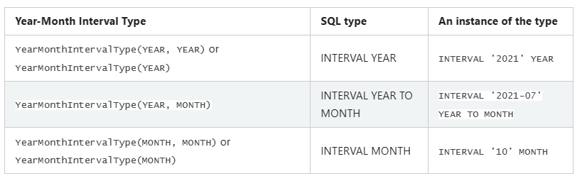
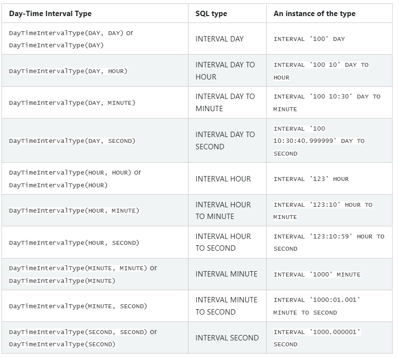

# Data Types

[TOC]

## Supported Data Types

> Spark SQL and DataFrames support the following data types:

Spark SQL 和 DataFrames 支持如下数据类型：

- Numeric types
	- `ByteType`: Represents 1-byte signed integer numbers. The range of numbers is from -128 to 127.
	
	- `ShortType`: Represents 2-byte signed integer numbers. The range of numbers is from -32768 to 32767.
	
	- `IntegerType`: Represents 4-byte signed integer numbers. The range of numbers is from -2147483648 to 2147483647.
	
	- `LongType`: Represents 8-byte signed integer numbers. The range of numbers is from -9223372036854775808 to 9223372036854775807.
	
	- `FloatType`: Represents 4-byte single-precision floating point numbers.
	
	- `DoubleType`: Represents 8-byte double-precision floating point numbers.
	
	- `DecimalType`: Represents arbitrary-precision signed decimal numbers. Backed internally by `java.math.BigDecimal`. A BigDecimal consists of an arbitrary precision integer unscaled value and a 32-bit integer scale.

- String type
	- `StringType`: Represents character string values.
	
	- `VarcharType(length)`: A variant of `StringType` which has a length limitation. Data writing will fail if the input string exceeds the length limitation. Note: this type can only be used in table schema, not functions/operators.
	
	- `CharType(length)`: A variant of `VarcharType(length)` which is fixed length. Reading column of type `CharType(n)` always returns string values of length n. `Char` type column comparison will pad the short one to the longer length.

- Binary type
	- `BinaryType`: Represents byte sequence values.
	
- Boolean type
	- `BooleanType`: Represents boolean values.
	
- Datetime type
	- `TimestampType`: Represents values comprising values of fields year, month, day, hour, minute, and second, with the session local time-zone. The timestamp value represents an absolute point in time.
	
	- `DateType`: Represents values comprising values of fields year, month and day, without a time-zone.

- Interval types
	- `YearMonthIntervalType(startField, endField)`: Represents a year-month interval which is made up of a contiguous subset of the following fields:
		- MONTH, months within years `[0..11]`,
		- YEAR, years in the range `[0..178956970]`.
	
	Individual interval fields are non-negative, but an interval itself can have a sign, and be negative.

	`startField` is the leftmost field, and `endField` is the rightmost field of the type. Valid values of `startField` and `endField` are 0(MONTH) and 1(YEAR). Supported year-month interval types are:

	

	- `DayTimeIntervalType(startField, endField)`: Represents a day-time interval which is made up of a contiguous subset of the following fields:
		- SECOND, seconds within minutes and possibly fractions of a second `[0..59.999999]`,
		- MINUTE, minutes within hours `[0..59]`,
		- HOUR, hours within days `[0..23]`,
		- DAY, days in the range `[0..106751991]`.

	Individual interval fields are non-negative, but an interval itself can have a sign, and be negative.

	`startField` is the leftmost field, and `endField` is the rightmost field of the type. Valid values of `startField` and `endField` are 0 (DAY), 1 (HOUR), 2 (MINUTE), 3 (SECOND). Supported day-time interval types are:

	

- Complex types
	- `ArrayType(elementType, containsNull)`: Represents values comprising a sequence of elements with the type of `elementType.containsNull` is used to indicate if elements in a `ArrayType` value can have null values.
	
	- `MapType(keyType, valueType, valueContainsNull)`: Represents values comprising a set of key-value pairs. The data type of keys is described by `keyType` and the data type of values is described by `valueType`. For a `MapType` value, keys are not allowed to have null values. `valueContainsNull` is used to indicate if values of a `MapType` value can have null values.
	
	- `StructType(fields)`: Represents values with the structure described by a sequence of `StructFields (fields)`.
		- `StructField(name, dataType, nullable)`: Represents a field in a `StructType`. The name of a field is indicated by `name`. The data type of a field is indicated by `dataType`. `nullable` is used to indicate if values of these fields can have null values.

### scala

All data types of Spark SQL are located in the package `org.apache.spark.sql.types`. You can access them by doing

```scala
import org.apache.spark.sql.types._
```
Find full example code at "examples/src/main/scala/org/apache/spark/examples/sql/SparkSQLExample.scala" in the Spark repo.

以下各语言和SQL数据类型对应关系见原文: [https://spark.apache.org/docs/3.3.2/sql-ref-datatypes.html](https://spark.apache.org/docs/3.3.2/sql-ref-datatypes.html)

### java

All data types of Spark SQL are located in the package of `org.apache.spark.sql.types`. To access or create a data type, please use factory methods provided in `org.apache.spark.sql.types.DataTypes`.

### python

All data types of Spark SQL are located in the package of `pyspark.sql.types`. You can access them by doing

```python
from pyspark.sql.types import *
```

### r


### sql

The following table shows the type names as well as aliases used in Spark SQL parser for each data type.

## Floating Point Special Values

Spark SQL supports several special floating point values in a case-insensitive manner:

- Inf/+Inf/Infinity/+Infinity: positive infinity
	- `FloatType`: equivalent to Scala `Float.PositiveInfinity`.
	- `DoubleType`: equivalent to Scala `Double.PositiveInfinity`.

- -Inf/-Infinity: negative infinity
	- `FloatType`: equivalent to Scala `Float.NegativeInfinity`.
	- `DoubleType`: equivalent to Scala `Double.NegativeInfinity`.

- NaN: not a number
	- `FloatType`: equivalent to Scala `Float.NaN`.
	- `DoubleType`: equivalent to Scala `Double.NaN`.

### Positive/Negative Infinity Semantics

There is special handling for positive and negative infinity. They have the following semantics:

- Positive infinity multiplied by any positive value returns positive infinity.
- Negative infinity multiplied by any positive value returns negative infinity.
- Positive infinity multiplied by any negative value returns negative infinity.
- Negative infinity multiplied by any negative value returns positive infinity.
- Positive/negative infinity multiplied by 0 returns NaN.
- Positive/negative infinity is equal to itself.
- In aggregations, all positive infinity values are grouped together. Similarly, all negative infinity values are grouped together.
- Positive infinity and negative infinity are treated as normal values in join keys.
- Positive infinity sorts lower than NaN and higher than any other values.
- Negative infinity sorts lower than any other values.

### NaN Semantics

There is special handling for not-a-number (NaN) when dealing with float or double types that do not exactly match standard floating point semantics. Specifically:

- NaN = NaN returns true.
- In aggregations, all NaN values are grouped together.
- NaN is treated as a normal value in join keys.
- NaN values go last when in ascending order, larger than any other numeric value.

### Examples

```sql
SELECT double('infinity') AS col;
+--------+
|     col|
+--------+
|Infinity|
+--------+

SELECT float('-inf') AS col;
+---------+
|      col|
+---------+
|-Infinity|
+---------+

SELECT float('NaN') AS col;
+---+
|col|
+---+
|NaN|
+---+

SELECT double('infinity') * 0 AS col;
+---+
|col|
+---+
|NaN|
+---+

SELECT double('-infinity') * (-1234567) AS col;
+--------+
|     col|
+--------+
|Infinity|
+--------+

SELECT double('infinity') < double('NaN') AS col;
+----+
| col|
+----+
|true|
+----+

SELECT double('NaN') = double('NaN') AS col;
+----+
| col|
+----+
|true|
+----+

SELECT double('inf') = double('infinity') AS col;
+----+
| col|
+----+
|true|
+----+

CREATE TABLE test (c1 int, c2 double);
INSERT INTO test VALUES (1, double('infinity'));
INSERT INTO test VALUES (2, double('infinity'));
INSERT INTO test VALUES (3, double('inf'));
INSERT INTO test VALUES (4, double('-inf'));
INSERT INTO test VALUES (5, double('NaN'));
INSERT INTO test VALUES (6, double('NaN'));
INSERT INTO test VALUES (7, double('-infinity'));
SELECT COUNT(*), c2 FROM test GROUP BY c2;
+---------+---------+
| count(1)|       c2|
+---------+---------+
|        2|      NaN|
|        2|-Infinity|
|        3| Infinity|
+---------+---------+
```