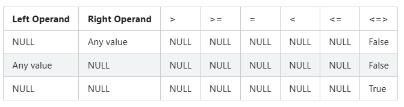
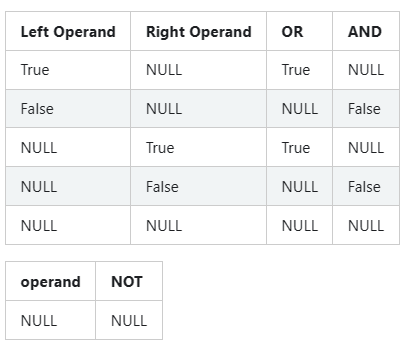

# NULL Semantics

[TOC]

## Description

> A table consists of a set of rows and each row contains a set of columns. A column is associated with a data type and represents a specific attribute of an entity (for example, `age` is a column of an entity called `person`). Sometimes, the value of a column specific to a row is not known at the time the row comes into existence. In SQL, such values are represented as `NULL`. This section details the semantics of `NULL` values handling in various operators, expressions and other SQL constructs.

一个表由多行组成，每行由多列组成。一列和数据类型、表示一个实体的属性相关（例如，age是名为person的实体的一列）。

有时候，特定于行的列值在行出现时还不知道。在 SQL 中，这样的值表示为 NULL。

本节详细介绍在各种操作符、表达式和其他SQL构造中处理NULL值的语义。

在SQL中，这样的值表示为NULL。本节详细介绍在各种操作符、表达式和其他SQL构造中处理NULL值的语义。

1. Null handling in comparison operators
2. Null handling in Logical operators
3. Null handling in Expressions
	1. Null handling in null-intolerant expressions
	2. Null handling Expressions that can process null value operands
	3. Null handling in built-in aggregate expressions
4. Null handling in WHERE, HAVING and JOIN conditions
5. Null handling in GROUP BY and DISTINCT
6. Null handling in ORDER BY
7. Null handling in UNION, INTERSECT, EXCEPT
8. Null handling in EXISTS and NOT EXISTS subquery
9. Null handling in IN and NOT IN subquery

> The following illustrates the schema layout and data of a table named `person`. The data contains `NULL` values in the `age` column and this table will be used in various examples in the sections below.

下面阐述了结构布局和名为 person 表的数据。age 列的数据包含了 NULL 值，这个表将用在下面的多个例子中。

> **TABLE: person**

Id  | Name  | Age
---|:---|:---
100 | Joe   | 30
200 | Marry	| NULL
300 | Mike	| 18
400 | Fred	| 50
500 | Albert| NULL
600 | Michelle|	30
700 | Dan   | 50

## Comparison Operators

> Apache spark supports the standard comparison operators such as ‘>’, ‘>=’, ‘=’, ‘<’ and ‘<=’. The result of these operators is unknown or `NULL` when one of the operands or both the operands are unknown or `NULL`. In order to compare the `NULL` values for equality, Spark provides a null-safe equal operator (‘<=>’), which returns `False` when one of the operand is `NULL` and returns ‘True’ when both the operands are NULL. The following table illustrates the behaviour of comparison operators when one or both operands are NULL:

spark 支持标准比较运算符，例如‘>’, ‘>=’, ‘=’, ‘<’ and ‘<=’. 

当其中之一的操作数或两个操作数是未知的或是 NULL 时，这些操作符的结果就是未知的或是 NULL.

为了和 NULL 值比较是否相等，spark 提供了 null 安全等于操作符 `<=>`，当其中一个操作数是 NULL 时，返回 False，当两个操作数同时都是 NULL 时，返回 True.



### Examples

```sql
-- Normal comparison operators return `NULL` when one of the operand is `NULL`.
SELECT 5 > null AS expression_output;
+-----------------+
|expression_output|
+-----------------+
|             null|
+-----------------+

-- Normal comparison operators return `NULL` when both the operands are `NULL`.
SELECT null = null AS expression_output;
+-----------------+
|expression_output|
+-----------------+
|             null|
+-----------------+

-- Null-safe equal operator return `False` when one of the operand is `NULL`
SELECT 5 <=> null AS expression_output;
+-----------------+
|expression_output|
+-----------------+
|            false|
+-----------------+

-- Null-safe equal operator return `True` when one of the operand is `NULL`
SELECT NULL <=> NULL;
+-----------------+
|expression_output|
+-----------------+
|             true|
+-----------------+
```

## Logical Operators

> Spark supports standard logical operators such as `AND`, `OR` and `NOT`. These operators take `Boolean` expressions as the arguments and return a `Boolean` value.

spark 支持标准逻辑运算符，例如`AND`, `OR` and `NOT`.

这些操作符接收 `Boolean` 表达式作为参数，并返回一个 `Boolean` 值。

> The following tables illustrate the behavior of logical operators when one or both operands are `NULL`.



### Examples

```sql
-- Normal comparison operators return `NULL` when one of the operands is `NULL`.
SELECT (true OR null) AS expression_output;
+-----------------+
|expression_output|
+-----------------+
|             true|
+-----------------+

-- Normal comparison operators return `NULL` when both the operands are `NULL`.
SELECT (null OR false) AS expression_output
+-----------------+
|expression_output|
+-----------------+
|             null|
+-----------------+

-- Null-safe equal operator returns `False` when one of the operands is `NULL`
SELECT NOT(null) AS expression_output;
+-----------------+
|expression_output|
+-----------------+
|             null|
+-----------------+
```

## Expressions

> The comparison operators and logical operators are treated as expressions in Spark. Other than these two kinds of expressions, Spark supports other form of expressions such as function expressions, cast expressions, etc. The expressions in Spark can be broadly classified as :

比较操作符和逻辑操作符都被当作表达式。除了这两类，spark 支持其他形式的表达式，例如函数表达式、转换表达式等。

spark 中的表达式可以按如下分类：

- 不允许 NULL 的表达式
- 可以处理 NULL 值操作数的表达式
	- 这些表达式的结果依赖于表达式本身

> Null intolerant expressions
> Expressions that can process NULL value operands
> The result of these expressions depends on the expression itself.

### Null Intolerant Expressions

> Null intolerant expressions return NULL when one or more arguments of expression are NULL and most of the expressions fall in this category.

当表达式的一个或多个参数是 NULL 时，不允许 NULL 的表达式返回 NULL。

#### Examples

```sql
SELECT concat('John', null) AS expression_output;
+-----------------+
|expression_output|
+-----------------+
|             null|
+-----------------+

SELECT positive(null) AS expression_output;
+-----------------+
|expression_output|
+-----------------+
|             null|
+-----------------+

SELECT to_date(null) AS expression_output;
+-----------------+
|expression_output|
+-----------------+
|             null|
+-----------------+
```

### Expressions That Can Process Null Value Operands

> This class of expressions are designed to handle `NULL` values. The result of the expressions depends on the expression itself. As an example, function expression `isnull` returns a `true` on null input and `false` on non null input where as function `coalesce` returns the first non `NULL` value in its list of operands. However, `coalesce` returns `NULL` when all its operands are `NULL`. Below is an incomplete list of expressions of this category.

这类表达式能够处理 NULL 值。表达式的结果依赖于表达式本身。

例如，函数表达式 isnull 的输入是 null 时返回 true，当输入不是 null 时返回 false。

函数 coalesce 返回参数列表中的第一个非 null 值。然而当所有的操作数都是 null 时，返回 null。 

- COALESCE
- NULLIF
- IFNULL
- NVL
- NVL2
- ISNAN
- NANVL
- ISNULL
- ISNOTNULL
- ATLEASTNNONNULLS
- IN

#### Examples

```sql
SELECT isnull(null) AS expression_output;
+-----------------+
|expression_output|
+-----------------+
|             true|
+-----------------+

-- Returns the first occurrence of non `NULL` value.
SELECT coalesce(null, null, 3, null) AS expression_output;
+-----------------+
|expression_output|
+-----------------+
|                3|
+-----------------+

-- Returns `NULL` as all its operands are `NULL`. 
SELECT coalesce(null, null, null, null) AS expression_output;
+-----------------+
|expression_output|
+-----------------+
|             null|
+-----------------+

SELECT isnan(null) AS expression_output;
+-----------------+
|expression_output|
+-----------------+
|            false|
+-----------------+
```

### Builtin Aggregate Expressions

> Aggregate functions compute a single result by processing a set of input rows. Below are the rules of how `NULL` values are handled by aggregate functions.

> `NULL` values are ignored from processing by all the aggregate functions.
> Only exception to this rule is `COUNT(*)` function.
> Some aggregate functions return `NULL` when all input values are `NULL` or the input data set is empty.
> The list of these functions is:

聚合函数会将一组输入行计算出一个结果。下面是聚合函数处理 NULL 值的规则。

- 所有聚合函数会忽略对 NULL 值的处理
	+ 唯一例外就是 `COUNT(*)` 函数
- 当所有输入值是 NULL 或输入数据集是空时，一些聚合函数返回 NULL
	
  这些函数是：

	+ MAX
	+ MIN
	+ SUM
	+ AVG
	+ EVERY
	+ ANY
	+ SOME

#### Examples

```sql
-- `count(*)` does not skip `NULL` values.
SELECT count(*) FROM person;
+--------+
|count(1)|
+--------+
|       7|
+--------+

-- `NULL` values in column `age` are skipped from processing.
SELECT count(age) FROM person;
+----------+
|count(age)|
+----------+
|         5|
+----------+

-- `count(*)` on an empty input set returns 0. This is unlike the other
-- aggregate functions, such as `max`, which return `NULL`.
SELECT count(*) FROM person where 1 = 0;
+--------+
|count(1)|
+--------+
|       0|
+--------+

-- `NULL` values are excluded from computation of maximum value.
SELECT max(age) FROM person;
+--------+
|max(age)|
+--------+
|      50|
+--------+

-- `max` returns `NULL` on an empty input set.
SELECT max(age) FROM person where 1 = 0;
+--------+
|max(age)|
+--------+
|    null|
+--------+
```

### Condition Expressions in WHERE, HAVING and JOIN Clauses

> `WHERE`, `HAVING` operators filter rows based on the user specified condition. A `JOIN` operator is used to combine rows from two tables based on a join condition. For all the three operators, a condition expression is a boolean expression and can return `True`, `False` or `Unknown (NULL)`. They are “satisfied” if the result of the condition is `True`.

`WHERE` 和 `HAVING` 操作符基于用户指定的条件过滤行。

`JOIN` 操作符基于连接条件，从两张表中合并行。

对于这三个操作符，条件表达式是一个布尔表达式，会返回 `True`, `False` or `Unknown (NULL)`.

如果条件的结果是 `True`，那么条件就是被满足的。

#### Examples

```sql
-- Persons whose age is unknown (`NULL`) are filtered out from the result set.
SELECT * FROM person WHERE age > 0;
+--------+---+
|    name|age|
+--------+---+
|Michelle| 30|
|    Fred| 50|
|    Mike| 18|
|     Dan| 50|
|     Joe| 30|
+--------+---+

-- `IS NULL` expression is used in disjunction to select the persons
-- with unknown (`NULL`) records.
SELECT * FROM person WHERE age > 0 OR age IS NULL;
+--------+----+
|    name| age|
+--------+----+
|  Albert|null|
|Michelle|  30|
|    Fred|  50|
|    Mike|  18|
|     Dan|  50|
|   Marry|null|
|     Joe|  30|
+--------+----+

-- Person with unknown(`NULL`) ages are skipped from processing.
SELECT age, count(*) FROM person GROUP BY age HAVING max(age) > 18;
+---+--------+
|age|count(1)|
+---+--------+
| 50|       2|
| 30|       2|
+---+--------+

-- A self join case with a join condition `p1.age = p2.age AND p1.name = p2.name`.
-- The persons with unknown age (`NULL`) are filtered out by the join operator.
SELECT * FROM person p1, person p2
    WHERE p1.age = p2.age
    AND p1.name = p2.name;
+--------+---+--------+---+
|    name|age|    name|age|
+--------+---+--------+---+
|Michelle| 30|Michelle| 30|
|    Fred| 50|    Fred| 50|
|    Mike| 18|    Mike| 18|
|     Dan| 50|     Dan| 50|
|     Joe| 30|     Joe| 30|
+--------+---+--------+---+

-- The age column from both legs of join are compared using null-safe equal which
-- is why the persons with unknown age (`NULL`) are qualified by the join.
SELECT * FROM person p1, person p2
    WHERE p1.age <=> p2.age
    AND p1.name = p2.name;
+--------+----+--------+----+
|    name| age|    name| age|
+--------+----+--------+----+
|  Albert|null|  Albert|null|
|Michelle|  30|Michelle|  30|
|    Fred|  50|    Fred|  50|
|    Mike|  18|    Mike|  18|
|     Dan|  50|     Dan|  50|
|   Marry|null|   Marry|null|
|     Joe|  30|     Joe|  30|
+--------+----+--------+----+
```

## Aggregate Operator (GROUP BY, DISTINCT)

> As discussed in the previous section comparison operator, two `NULL` values are not equal. However, for the purpose of grouping and distinct processing, the two or more values with `NULL` data are grouped together into the same bucket. This behaviour is conformant with SQL standard and with other enterprise database management systems.

就像前面比较运算符描述的一样，两个 NULL 值不相等。

然而，对于分组和去重操作，具有 NULL 的两个或更多值被分组到相同的桶里。这个行为满足 SQL 标准和其他数据库管理系统。

### Examples

```sql
-- `NULL` values are put in one bucket in `GROUP BY` processing.
SELECT age, count(*) FROM person GROUP BY age;
+----+--------+
| age|count(1)|
+----+--------+
|null|       2|
|  50|       2|
|  30|       2|
|  18|       1|
+----+--------+

-- All `NULL` ages are considered one distinct value in `DISTINCT` processing.
SELECT DISTINCT age FROM person;
+----+
| age|
+----+
|null|
|  50|
|  30|
|  18|
+----+
```

## Sort Operator (ORDER BY Clause)

> Spark SQL supports null ordering specification in `ORDER BY` clause. Spark processes the `ORDER BY` clause by placing all the `NULL` values at first or at last depending on the null ordering specification. By default, all the `NULL` values are placed at first.

Spark SQL 支持在 `ORDER BY` 子句中的 null 排序规范。Spark 通过把 NULL 值放在开头或结尾来处理 `ORDER BY` 子句，具体取决于 null 排序规范。

默认，所有的 NULL 值放在开头。

### Examples

```sql
-- `NULL` values are shown at first and other values
-- are sorted in ascending way.
SELECT age, name FROM person ORDER BY age;
+----+--------+
| age|    name|
+----+--------+
|null|   Marry|
|null|  Albert|
|  18|    Mike|
|  30|Michelle|
|  30|     Joe|
|  50|    Fred|
|  50|     Dan|
+----+--------+

-- Column values other than `NULL` are sorted in ascending
-- way and `NULL` values are shown at the last.
SELECT age, name FROM person ORDER BY age NULLS LAST;
+----+--------+
| age|    name|
+----+--------+
|  18|    Mike|
|  30|Michelle|
|  30|     Joe|
|  50|     Dan|
|  50|    Fred|
|null|   Marry|
|null|  Albert|
+----+--------+

-- Columns other than `NULL` values are sorted in descending
-- and `NULL` values are shown at the last.
SELECT age, name FROM person ORDER BY age DESC NULLS LAST;
+----+--------+
| age|    name|
+----+--------+
|  50|    Fred|
|  50|     Dan|
|  30|Michelle|
|  30|     Joe|
|  18|    Mike|
|null|   Marry|
|null|  Albert|
+----+--------+
```

## Set Operators (UNION, INTERSECT, EXCEPT)

> `NULL` values are compared in a null-safe manner for equality in the context of set operations. That means when comparing rows, two `NULL` values are considered equal unlike the regular `EqualTo(=)` operator.

在集合操作符场景下，NULL 值以 null 安全的方式比较相等。这就意味着，当比较两行时，两个 NULL 值被认为是相等的，而不像 `EqualTo(=)` 操作符一样。

### Examples

```sql
CREATE VIEW unknown_age SELECT * FROM person WHERE age IS NULL;

-- Only common rows between two legs of `INTERSECT` are in the 
-- result set. The comparison between columns of the row are done
-- in a null-safe manner.
SELECT name, age FROM person
    INTERSECT
    SELECT name, age from unknown_age;
+------+----+
|  name| age|
+------+----+
|Albert|null|
| Marry|null|
+------+----+

-- `NULL` values from two legs of the `EXCEPT` are not in output. 
-- This basically shows that the comparison happens in a null-safe manner.
SELECT age, name FROM person
    EXCEPT
    SELECT age FROM unknown_age;
+---+--------+
|age|    name|
+---+--------+
| 30|     Joe|
| 50|    Fred|
| 30|Michelle|
| 18|    Mike|
| 50|     Dan|
+---+--------+

-- Performs `UNION` operation between two sets of data. 
-- The comparison between columns of the row ae done in
-- null-safe manner.
SELECT name, age FROM person
    UNION 
    SELECT name, age FROM unknown_age;
+--------+----+
|    name| age|
+--------+----+
|  Albert|null|
|     Joe|  30|
|Michelle|  30|
|   Marry|null|
|    Fred|  50|
|    Mike|  18|
|     Dan|  50|
+--------+----+
```

## EXISTS/NOT EXISTS Subquery

> In Spark, `EXISTS` and `NOT EXISTS` expressions are allowed inside a `WHERE` clause. These are boolean expressions which return either `TRUE` or `FALSE`. In other words, `EXISTS` is a membership condition and returns `TRUE` when the subquery it refers to returns one or more rows. Similarly, `NOT EXISTS` is a non-membership condition and returns `TRUE` when no rows or zero rows are returned from the subquery.

在 spark 中，允许在 `WHERE` 子句中使用 `EXISTS` 和 `NOT EXISTS` 表达式。

存在布尔表达式，要么返回 `TRUE` 要么返回 `FALSE`。

换句话说，`EXISTS` 是一个关系条件，当它引用的子句返回一行或多行时，就返回 `TRUE`。`NOT EXISTS`是一个非关系条件，当它引用的子句没有行返回或返回0行时，就返回 `TRUE`。

> These two expressions are not affected by presence of `NULL` in the result of the subquery. They are normally faster because they can be converted to semijoins / anti-semijoins without special provisions for null awareness.

当 NULL 存在于子查询结果中，这两个表达式不被影响。它们会更快，因为它们被转换成 semijoins 或 anti-semijoins，没有对 null 的特殊规定。

### Examples

```sql
-- Even if subquery produces rows with `NULL` values, the `EXISTS` expression
-- evaluates to `TRUE` as the subquery produces 1 row.
SELECT * FROM person WHERE EXISTS (SELECT null);
+--------+----+
|    name| age|
+--------+----+
|  Albert|null|
|Michelle|  30|
|    Fred|  50|
|    Mike|  18|
|     Dan|  50|
|   Marry|null|
|     Joe|  30|
+--------+----+

-- `NOT EXISTS` expression returns `FALSE`. It returns `TRUE` only when
-- subquery produces no rows. In this case, it returns 1 row.
SELECT * FROM person WHERE NOT EXISTS (SELECT null);
+----+---+
|name|age|
+----+---+
+----+---+

-- `NOT EXISTS` expression returns `TRUE`.
SELECT * FROM person WHERE NOT EXISTS (SELECT 1 WHERE 1 = 0);
+--------+----+
|    name| age|
+--------+----+
|  Albert|null|
|Michelle|  30|
|    Fred|  50|
|    Mike|  18|
|     Dan|  50|
|   Marry|null|
|     Joe|  30|
+--------+----+
```

## IN/NOT IN Subquery

> In Spark, `IN` and `NOT IN` expressions are allowed inside a `WHERE` clause of a query. Unlike the `EXISTS` expression, `IN` expression can return a `TRUE`, `FALSE` or `UNKNOWN (NULL)` value. Conceptually a `IN` expression is semantically equivalent to a set of equality condition separated by a disjunctive operator (`OR`). For example, `c1 IN (1, 2, 3)` is semantically equivalent to `(C1 = 1 OR c1 = 2 OR c1 = 3)`.

在 spark 中，`IN` 和 `NOT IN` 表达式允许出现在 `WHERE` 子句中。不同于 `EXISTS` 表达式，`IN` 表达式能返回 `TRUE`, `FALSE` or `UNKNOWN (NULL)` 值。

> As far as handling `NULL` values are concerned, the semantics can be deduced from the `NULL` value handling in comparison operators(`=`) and logical operators(`OR`). To summarize, below are the rules for computing the result of an `IN` expression.

关于 NULL 值的处理，可以从比较运算符`=`和逻辑运算符`OR`中处理 NULL 值推导出相关语义。

- 当 non-NULL 值在列表中找到时，返回 `TRUE`
- 当 non-NULL 值没有在列表中找到时，且列表不包含 NULL 值，返回 `FALSE`
- 当值为 `NULL` 时，或 non-NULL 值没有在列表中找到，且列表至少包含一个 NULL 值时，返回 `UNKNOWN`

> `TRUE` is returned when the non-NULL value in question is found in the list
> `FALSE` is returned when the non-NULL value is not found in the list and the list does not contain `NULL` values
> `UNKNOWN` is returned when the value is `NULL`, or the non-NULL value is not found in the list and the list contains at least one `NULL` value

> `NOT IN` always returns `UNKNOWN` when the list contains `NULL`, regardless of the input value. This is because `IN` returns `UNKNOWN` if the value is not in the list containing `NULL`, and because NOT UNKNOWN is again UNKNOWN.

当列表包含 NULL，不管输入值怎样，`NOT IN` 总是返回 `UNKNOWN`。

### Examples

```sql
-- The subquery has only `NULL` value in its result set. Therefore,
-- the result of `IN` predicate is UNKNOWN.
SELECT * FROM person WHERE age IN (SELECT null);
+----+---+
|name|age|
+----+---+
+----+---+

-- The subquery has `NULL` value in the result set as well as a valid 
-- value `50`. Rows with age = 50 are returned. 
SELECT * FROM person
    WHERE age IN (SELECT age FROM VALUES (50), (null) sub(age));
+----+---+
|name|age|
+----+---+
|Fred| 50|
| Dan| 50|
+----+---+

-- Since subquery has `NULL` value in the result set, the `NOT IN`
-- predicate would return UNKNOWN. Hence, no rows are
-- qualified for this query.
SELECT * FROM person
    WHERE age NOT IN (SELECT age FROM VALUES (50), (null) sub(age));
+----+---+
|name|age|
+----+---+
+----+---+
```