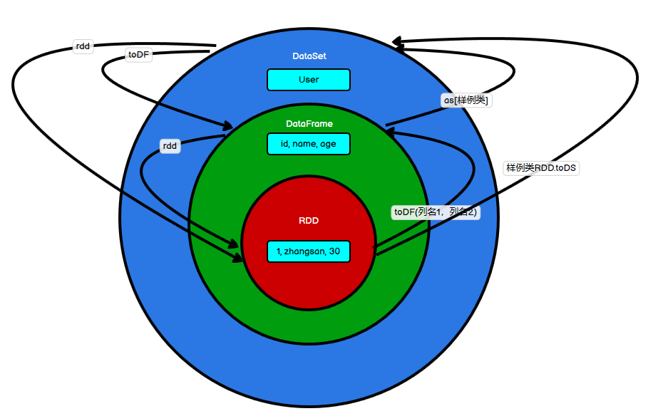

# RDD 、DataFrame 、DataSet 三者的关系

[TOC]

**来自：[尚硅谷 spark 视频教程](https://www.bilibili.com/video/BV11A411L7CK?p=159)**

## 1 产生版本

首先从版本的产生上来看：

- Spark1.0 => RDD
- Spark1.3 => DataFrame
- Spark1.6 => Dataset

如果同样的数据都给到这三个数据结构，他们分别计算之后，都会给出相同的结果。

不同是的他们的执行效率和执行方式。

在后期的 Spark 版本中，DataSet 有可能会逐步取代 RDD 和 DataFrame 成为唯一的 API 接口。

## 2 共性

- RDD、DataFrame、DataSet 全都是 spark 平台下的分布式弹性数据集，为处理超大型数据提供便利

- 三者都有惰性机制，在进行创建、转换，如 map 方法时，不会立即执行，只有在遇到 Action 如 foreach 时，三者才会开始遍历运算

- 三者有许多共同的函数，如 filter，排序等

- 在对 DataFrame 和 Dataset 进行操作许多操作都需要这个包:`import spark.implicits._`（在
创建好 SparkSession 对象后尽量直接导入）

- 三者都会根据 Spark 的内存情况自动缓存运算，这样即使数据量很大，也不用担心会内存溢出

- 三者都有 partition 的概念

- DataFrame 和 DataSet 均可使用模式匹配获取各个字段的值和类型

## 3 区别

- RDD
	- RDD 一般和 spark mllib 同时使用
	- RDD 不支持 sparksql 操作

- DataFrame
	- 与 RDD 和 Dataset 不同，DataFrame 每一行的类型固定为 Row，每一列的值没法直接访问，只有通过解析才能获取各个字段的值
	- DataFrame 与 DataSet 一般不与 spark mllib 同时使用
	- DataFrame 与 DataSet 均支持 SparkSQL 的操作，比如 select，groupby 之类，还能注册临时表/视窗，进行 sql 语句操作
	- DataFrame 与 DataSet 支持一些特别方便的保存方式，比如保存成 csv，可以带上表头，这样每一列的字段名一目了然

- DataSet
	- Dataset 和 DataFrame 拥有完全相同的成员函数，区别只是每一行的数据类型不同。DataFrame 其实就是 DataSet 的一个特例 `type DataFrame = Dataset[Row]`
	- DataFrame 也可以叫 `Dataset[Row]`, 每一行的类型是 Row，不解析，每一行究竟有哪些字段，各个字段又是什么类型都无从得知，只能用上面提到的 getAS 方法或者共性中的第七条提到的模式匹配拿出特定字段。而 Dataset 中，每一行是什么类型是不一定的，在自定义了 `case class` 之后可以很自由的获得每一行的信息
	
## 4 互相转换



### 4.1 RDD <--> DataSet

#### 4.1.1 RDD --> DataSet

SparkSQL 能够自动将包含有样例类的 RDD 转换成 DataSet，样例类定义了 table 的结构，样例类属性通过反射变成了表的列名。

样例类可以包含诸如 Seq 或者 Array 等复杂的结构。

```scala
scala> case class User(name:String, age:Int)
defined class User

scala> sc.makeRDD(List(("zhangsan",30), ("lisi",49))).map(t=>User(t._1,t._2)).toDS
res11: org.apache.spark.sql.Dataset[User] = [name: string, age: int]
```

#### 4.1.2 RDD <-- DataSet

DataSet 其实也是对 RDD 的封装，所以可以直接获取内部的 RDD

```scala
scala> case class User(name:String, age:Int)
defined class User

scala> sc.makeRDD(List(("zhangsan",30), ("lisi",49))).map(t=>User(t._1,t._2)).toDS
res11: org.apache.spark.sql.Dataset[User] = [name: string, age: int]

scala> val rdd = res11.rdd
rdd: org.apache.spark.rdd.RDD[User] = MapPartitionsRDD[51] at rdd at <console>:25

scala> rdd.collect
res12: Array[User] = Array(User(zhangsan,30), User(lisi,49))
```

### 4.2 DataFrame <--> DataSet

#### 4.2.1  DataFrame --> DataSet

```scala
scala> case class User(name:String, age:Int)
defined class User

scala> val df = sc.makeRDD(List(("zhangsan",30),("lisi",49))).toDF("name","age")
df: org.apache.spark.sql.DataFrame = [name: string, age: int]

scala> val ds = df.as[User]
ds: org.apache.spark.sql.Dataset[User] = [name: string, age: int]
```

#### 4.2.2 DataFrame <-- DataSet

```scala
scala> val ds = df.as[User]
ds: org.apache.spark.sql.Dataset[User] = [name: string, age: int]

scala> val df = ds.toDF
df: org.apache.spark.sql.DataFrame = [name: string, age: int]
```

### 4.3 RDD <--> DataFrame

#### 4.3.1 RDD --> DataFrame

```scala
scala> val idRDD = sc.textFile("data/id.txt")

scala> idRDD.toDF("id").show
+---+
| id|
+---+
| 1|
| 2|
| 3|
| 4|
+---+
```

实际开发中，一般通过样例类将 RDD 转换为 DataFrame

```scala
scala> case class User(name:String, age:Int)
defined class User
scala> sc.makeRDD(List(("zhangsan",30), ("lisi",40))).map(t=>User(t._1,
t._2)).toDF.show
+--------+---+
| name|age|
+--------+---+
|zhangsan| 30|
| lisi| 40|
+--------+---+
```

#### 4.3.2 RDD <-- DataFrame

```scala
scala> val df = sc.makeRDD(List(("zhangsan",30), ("lisi",40))).map(t=>User(t._1,t._2)).toDF
df: org.apache.spark.sql.DataFrame = [name: string, age: int]

scala> val rdd = df.rdd
rdd: org.apache.spark.rdd.RDD[org.apache.spark.sql.Row] = MapPartitionsRDD[46] at rdd at <console>:25

scala> val array = rdd.collect
array: Array[org.apache.spark.sql.Row] = Array([zhangsan,30], [lisi,40])
```

注意：此时得到的 RDD 存储类型为 Row

```scala
scala> array(0)
res28: org.apache.spark.sql.Row = [zhangsan,30]

scala> array(0)(0)
res29: Any = zhangsan

scala> array(0).getAs[String]("name")
res30: String = zhangsan
```