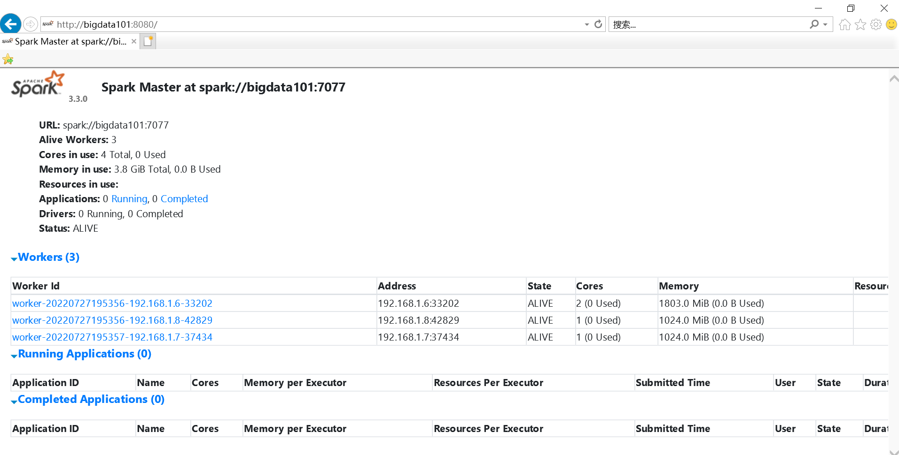
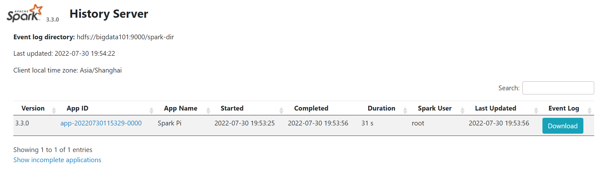
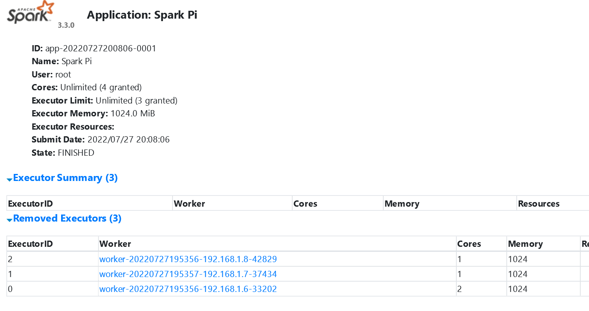
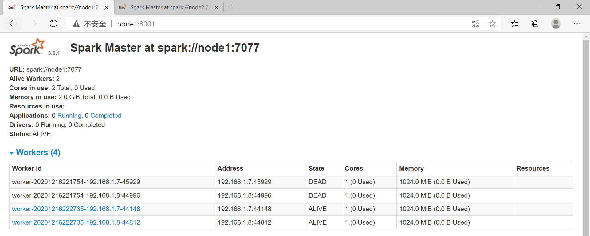
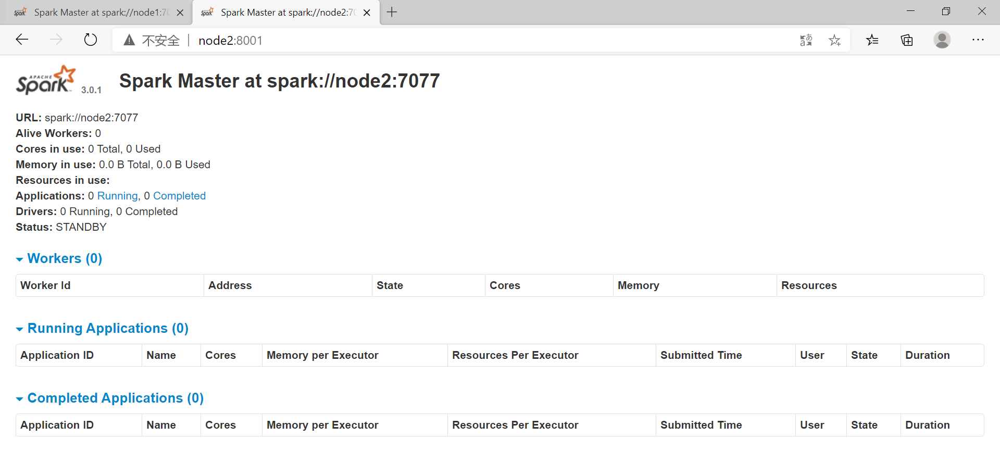
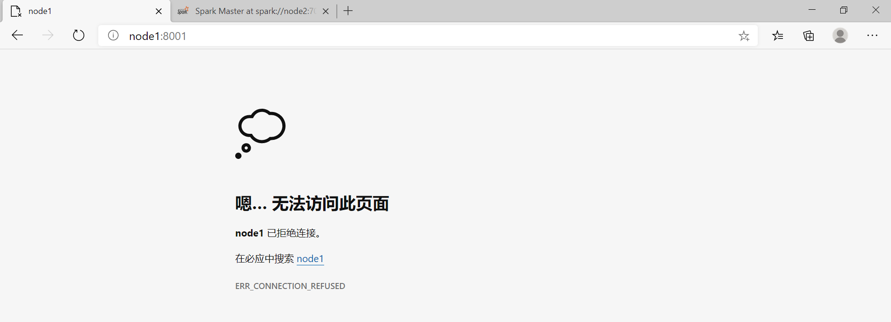
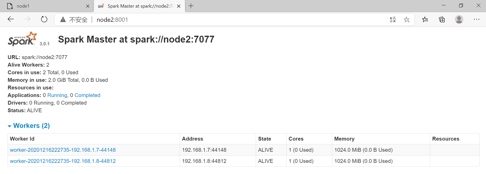
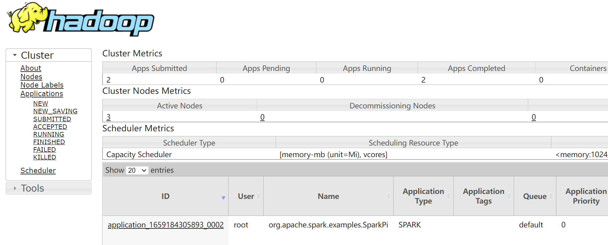
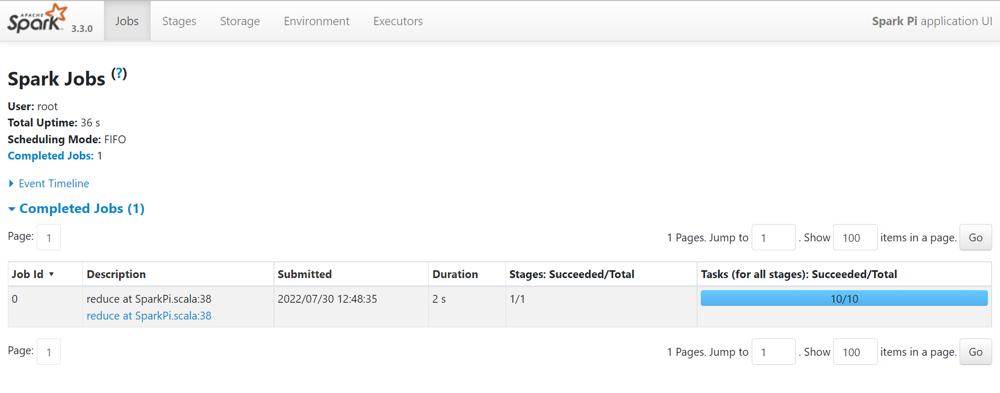

# 环境搭建

[TOC]


先安装jdk、scala

下载: [http://archive.apache.org/dist/spark/](http://archive.apache.org/dist/spark/)

要查看 web ui 界面，需要将主机名和ip地址的映射写到宿主机的 hosts 文件中

## 1 Local模式

Local 模式就是不需要其他任何节点资源就可以在本地执行 Spark 代码的环境，一般用于教学，调试，演示等。

解压 jar 包，并重命名

```sh
root@bigdata101:~# tar -zxvf spark-3.3.0-bin-hadoop3.tgz -C /opt/

root@bigdata101:/opt# mv spark-3.3.0-bin-hadoop3/ spark-local/
root@bigdata101:/opt# ls
spark-local
```

进入解压缩后的路径，执行

```sh
root@bigdata101:/opt/spark-local# bin/spark-shell
Setting default log level to "WARN".
To adjust logging level use sc.setLogLevel(newLevel). For SparkR, use setLogLevel(newLevel).
22/07/30 10:14:49 WARN NativeCodeLoader: Unable to load native-hadoop library for your platform... using builtin-java classes where applicable
Spark context Web UI available at http://bigdata101:4040
Spark context available as 'sc' (master = local[*], app id = local-1659176092114).
Spark session available as 'spark'.
Welcome to
      ____              __
     / __/__  ___ _____/ /__
    _\ \/ _ \/ _ `/ __/  '_/
   /___/ .__/\_,_/_/ /_/\_\   version 3.3.0
      /_/
         
Using Scala version 2.12.15 (Java HotSpot(TM) 64-Bit Server VM, Java 1.8.0_341)
Type in expressions to have them evaluated.
Type :help for more information.

scala> 
```

启动成功后，可以输入网址 `http://bigdata101:4040` 进行 Web UI 监控页面访问。

在命令行工具中执行如下代码

```sh
scala> sc.textFile("file:///opt/spark-local/README.md").flatMap(_.split(" ")).map((_,1)).reduceByKey(_+_).collect
res1: Array[(String, Int)] = Array((package,1), (this,1), (integration,1), (Python,2), (cluster.,1), (its,1), ([run,1), (There,1), (general,2), (have,1), (pre-built,1), (Because,1), (YARN,,1), (locally,2), (changed,1), (locally.,1), (several,1), (only,1), (Configuration,1), (This,2), (basic,1), (first,1), (learning,,1), (documentation,3), (graph,1), (Hive,2), (info,1), (["Specifying,1), ("yarn",1), ([params]`.,1), ([project,1), (prefer,1), (SparkPi,2), (engine,2), (version,1), (file,1), (documentation,,1), (Action,1), (MASTER,1), (example,3), (are,1), (systems.,1), (params,1), (scala>,1), (DataFrames,,1), (provides,1), (refer,2), (configure,1), (Interactive,2), (R,,1), (can,6), (build,3), (when,1), (easiest,1), (Maven](https://maven.apache.org/).,1), (Apache,1)...
```

提交应用

```sh
bin/spark-submit \
--class org.apache.spark.examples.SparkPi \
--master local[2] \
./examples/jars/spark-examples_2.12-3.3.0.jar \
10
```

- --class: 表示要执行程序的主类
- --master local[2]: 部署模式，默认为本地模式，数字表示运行的线程数
- spark-examples_2.12-3.3.0.jar: 运行的应用类所在的 jar 包
- 数字 10: 表示程序的参数

## 2 Standalone 模式

集群规划

```
bigdata101 - master worker
bigdata102 - worker
bigdata103 - worker
```

解压 jar 包，并重命名

```sh
root@bigdata101:/# tar -zxvf spark-3.3.0-bin-hadoop3.tgz -C /opt/
root@bigdata101:/opt# mv spark-3.3.0-bin-hadoop3 spark-standalone
```

配置配置文件

```sh
root@bigdata101:/opt/spark-standalone/conf# ls
fairscheduler.xml.template  metrics.properties.template   spark-env.sh.template
log4j2.properties.template  spark-defaults.conf.template  workers.template

root@bigdata101:/opt/spark-standalone/conf# mv workers.template workers
root@bigdata101:/opt/spark-standalone/conf# vi workers
bigdata101
bigdata102
bigdata103
```

```sh
root@bigdata101:/opt/spark-standalone/conf# mv spark-env.sh.template spark-env.sh
root@bigdata101:/opt/spark-standalone/conf# vi spark-env.sh
export JAVA_HOME=/opt/jdk-11.0.16
export SCALA_HOME=/opt/scala-2.12.16
export HADOOP_HOME=/opt/hadoop-3.3.3
export HADOOP_CONF_DIR=/opt/hadoop-3.3.3/etc/hadoop
export SPARK_MASTER_HOST=bigdata101
export SPARK_MASTER_PORT=7077
# 配置历史服务器
export SPARK_HISTORY_OPTS="   
-Dspark.history.ui.port=18080
-Dspark.history.fs.logDirectory=hdfs://bigdata101:9000/spark-dir
-Dspark.history.retainedApplications=30"

# -p PORT, --port PORT: Port for service to listen on (default: 7077 for master, random for worker)
```

`SPARK_HISTORY_OPTS` 参数含义: 

- 参数 1 含义：WEB UI 访问的端口号为 18080
- 参数 2 含义：指定历史服务器日志存储路径
- 参数 3 含义：指定保存 Application 历史记录的个数，如果超过这个值，旧的应用程序信息将被删除，这个是内存中的应用数，而不是页面上显示的应用数


由于 spark-shell 停止掉后，集群监控 `bigdata101:4040` 页面就看不到历史任务的运行情况，所以开发时都配置历史服务器记录任务运行情况。

```sh
root@bigdata101:/opt/spark-standalone/conf# mv spark-defaults.conf.template spark-defaults.conf
root@bigdata101:/opt/spark-standalone/conf# vi spark-defaults.conf
# 配置历史服务器
spark.eventLog.enabled true
spark.eventLog.dir hdfs://bigdata101:9000/spark-dir  # HDFS 上的 spark-dir 目录需要提前存在
```

```sh
root@bigdata101:/opt# scp -r spark-standalone/ root@bigdata102:/opt
root@bigdata101:/opt# scp -r spark-standalone/ root@bigdata103:/opt
```

先启动 hadoop, 再启动 spark

```sh
root@bigdata101:/opt/spark-standalone# sbin/start-all.sh
starting org.apache.spark.deploy.master.Master, logging to /opt/spark-standalone/logs/spark-root-org.apache.spark.deploy.master.Master-1-bigdata101.out
bigdata102: starting org.apache.spark.deploy.worker.Worker, logging to /opt/spark-standalone/logs/spark-root-org.apache.spark.deploy.worker.Worker-1-bigdata102.out
bigdata103: starting org.apache.spark.deploy.worker.Worker, logging to /opt/spark-standalone/logs/spark-root-org.apache.spark.deploy.worker.Worker-1-bigdata103.out
bigdata101: starting org.apache.spark.deploy.worker.Worker, logging to /opt/spark-standalone/logs/spark-root-org.apache.spark.deploy.worker.Worker-1-bigdata101.outut

root@bigdata101:/opt/spark-standalone# sbin/start-history-server.sh
starting org.apache.spark.deploy.history.HistoryServer, logging to /opt/spark-standalone/logs/spark-root-org.apache.spark.deploy.history.HistoryServer-1-bigdata101.out

root@bigdata101:/opt/spark-standalone# jps
6544 Worker
5954 NodeManager
5459 DataNode
6693 Jps
6406 Master
6632 HistoryServer
5304 NameNode
5805 ResourceManager

root@bigdata102:~# jps
3602 Jps
2916 DataNode
3146 NodeManager
3547 Worker
3022 SecondaryNameNode

root@bigdata103:~# jps
2821 Jps
2377 DataNode
2762 Worker
2523 NodeManager
```

查看 Master 资源监控 Web UI 界面 `http://bigdata101:8080/`



提交应用

```sh
bin/spark-submit \
--class org.apache.spark.examples.SparkPi \
--master spark://bigdata101:7077 \
./examples/jars/spark-examples_2.12-3.3.0.jar \
10
```

- --master spark://bigdata101:7077 独立部署模式，连接到 Spark 集群

查看历史服务 `http://bigdata101:18080`



执行任务时，会产生多个 Java 进程


执行任务时，默认采用服务器集群节点的总核数，每个节点内存 1024M



### 2.1 配置高可用

安装 ZOOKEEPER 参考 [ZOOKEEPER完全分布式](https://github.com/ZGG2016/knowledgesystem/blob/master/19%20Zookeeper/%E7%8E%AF%E5%A2%83%E6%90%AD%E5%BB%BA.md)

修改 spark-env.sh 文件

```sh
#注释如下内容：
#SPARK_MASTER_HOST=bigdata101
#SPARK_MASTER_PORT=7077

#添加如下内容:
#Master 监控页面默认访问端口为 8080，但是可能会和 Zookeeper 冲突，所以改成 8989，也可以自定义，访问 UI 监控页面时请注意
export SPARK_MASTER_WEBUI_PORT=8989
export SPARK_DAEMON_JAVA_OPTS="
-Dspark.deploy.recoveryMode=ZOOKEEPER
-Dspark.deploy.zookeeper.url=bigdata101:2181,bigdata102:2181,bigdata103:2181
-Dspark.deploy.zookeeper.dir=/opt/spark-standalone/zkspark"
```

启动

```sh
[root@node1 sbin]# start-all.sh
starting org.apache.spark.deploy.master.Master, logging to /opt/spark-3.0.1-bin-hadoop3.2/logs/spark-root-org.apache.spark.deploy.master.Master-1-node1.out
node2: starting org.apache.spark.deploy.worker.Worker, logging to /opt/spark-3.0.1-bin-hadoop3.2/logs/spark-root-org.apache.spark.deploy.worker.Worker-1-node2.out
node3: starting org.apache.spark.deploy.worker.Worker, logging to /opt/spark-3.0.1-bin-hadoop3.2/logs/spark-root-org.apache.spark.deploy.worker.Worker-1-node3.out

[root@node2 spark-3.0.1-bin-hadoop3.2]# sbin/start-master.sh
starting org.apache.spark.deploy.master.Master, logging to /opt/spark-3.0.1-bin-hadoop3.2/logs/spark-root-org.apache.spark.deploy.master.Master-1-node2.out

[root@node1 sbin]# jps
7666 QuorumPeerMain
11666 JournalNode
12722 NodeManager
13683 Master
12580 ResourceManager
11910 NameNode
13769 Jps
12924 DFSZKFailoverController
12062 DataNode

[root@node2 spark-3.0.1-bin-hadoop3.2]# jps
10112 ResourceManager
11250 Worker
11394 Jps
10533 DFSZKFailoverController
9878 NameNode
10198 NodeManager
9975 DataNode
11308 Master
7629 QuorumPeerMain
9791 JournalNode

[root@node3 spark-3.0.1-bin-hadoop3.2]# jps
9713 Jps
8930 DataNode
8835 JournalNode
9044 NodeManager
7562 QuorumPeerMain
9663 Worker
```

分别在浏览器输入 `node1:8080` 、`node2:8080`，如下所示，发现 node1 为 `ALIVE`， node2 为 `STANDBY`





此时，kill 掉 node1 上的 master 

```sh
[root@node1 spark-3.0.1-bin-hadoop3.2]# kill -9 13683
[root@node1 spark-3.0.1-bin-hadoop3.2]# jps
7666 QuorumPeerMain
11666 JournalNode
12722 NodeManager
12580 ResourceManager
11910 NameNode
12924 DFSZKFailoverController
12062 DataNode
13807 Jps
```

再查看，发现 node1 已打不开，node2 成为 `ALIVE`。说明 node2 代替 node1 成为 `Master`





## 3 Yarn模式

解压 jar 包，并重命名

```sh
root@bigdata101:~# tar -zxvf spark-3.3.0-bin-hadoop3.tgz -C /opt
root@bigdata101:/opt# mv spark-3.3.0-bin-hadoop3/ spark-yarn/
root@bigdata101:/opt# ls
spark-yarn
```

修改 hadoop 配置文件 yarn-site.xml, 并分发

```sh
<!--是否启动一个线程检查每个任务正使用的物理内存量，如果任务超出分配值，则直接将其杀掉，默认是 true -->
<property>
   <name>yarn.nodemanager.pmem-check-enabled</name>
   <value>false</value>
</property>
<!--是否启动一个线程检查每个任务正使用的虚拟内存量，如果任务超出分配值，则直接将其杀掉，默认是 true -->
<property>
   <name>yarn.nodemanager.vmem-check-enabled</name>
   <value>false</value>
</property>
```

修改 `conf/spark-env.sh`

```sh
root@bigdata101:/opt/spark-yarn# vi conf/spark-env.sh
export JAVA_HOME=/opt/jdk-11.0.16
export YARN_CONF_DIR=/opt/hadoop-3.3.3/etc/hadoop
```

配置历史服务器

```sh
root@bigdata101:/opt/spark-yarn/conf# mv spark-defaults.conf.template spark-defaults.conf
root@bigdata101:/opt/spark-yarn/conf# vi spark-defaults.conf
spark.eventLog.enabled true
spark.eventLog.dir hdfs://bigdata101:9000/spark-dir
spark.yarn.historyServer.address=bigdata101:18080
spark.history.ui.port=18080
```

```sh
root@bigdata101:/opt/spark-yarn/conf# vi spark-env.sh
export SPARK_HISTORY_OPTS="
-Dspark.history.ui.port=18080
-Dspark.history.fs.logDirectory=hdfs://bigdata101:9000/spark-dir
-Dspark.history.retainedApplications=30"
```

启动 Hadoop 集群，启动历史服务

```sh
root@bigdata101:/opt/spark-yarn# sbin/start-history-server.sh
```

提交应用

```sh
root@bigdata101:/opt/spark-yarn# bin/spark-submit \
--class org.apache.spark.examples.SparkPi \
--master yarn \
--deploy-mode cluster \
./examples/jars/spark-examples_2.12-3.3.0.jar \
10
......
      client token: N/A
         diagnostics: N/A
         ApplicationMaster host: bigdata101
         ApplicationMaster RPC port: 35281
         queue: default
         start time: 1659185267705
         final status: SUCCEEDED
         tracking URL: http://bigdata101:8088/proxy/application_1659184305893_0002/
         user: root
......         
```

查看 `http://bigdata101:8088/` 页面



查看历史页面



## 4 部署在window系统下

将压缩包解压到无中文无空格的路径下即可

执行解压缩文件路径下 bin 目录中的 `spark-shell.cmd` 文件，启动 Spark 本地环境

可以在 DOS 命令行窗口中执行提交指令

```sh
spark-submit 
--class org.apache.spark.examples.SparkPi 
--masterlocal[2] 
../examples/jars/spark-examples_2.12-3.0.0.jar 
10
```